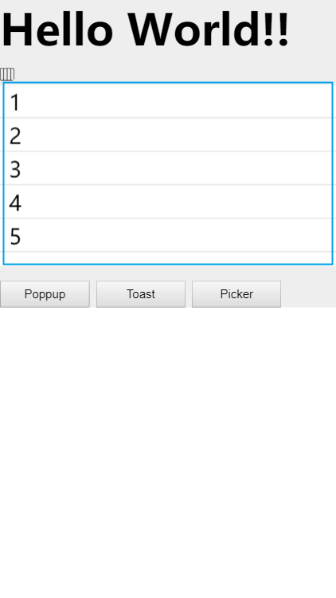

# Foldlist

下拉展开全部列表，使用时确保列表数据的不为空，数量不可变（暂不支持异步渲染）；

## 引入

```javascript
// 引入展开列表组件
import foldList from '../../appassets/components/Foldlist';
import foldItem from '../../appassets/components/Folditem';
export default {
    components: {
        foldList,
        foldItem
    },
};
```

## 例子

`initialNumber`该参数表示列表数量大于（不包括）初始数目时折叠否则，小于等于概述目时，没有`展开更多`button；

```html
<t-foldlist>
    <t-folditem v-for="i in 15" :key="i" initial-number='5'>
         {{ i }}
    </t-folditem>
</t-foldlist>
```

## API

| 参数            | 说明            | 类型     | 可选值  | 默认值  |
| ------------- | ------------- | ------ | ---- | ---- |
| initialNumber | 初始状态显示列表项目的数量 | Number | -    | 2    |

---

## 案例



