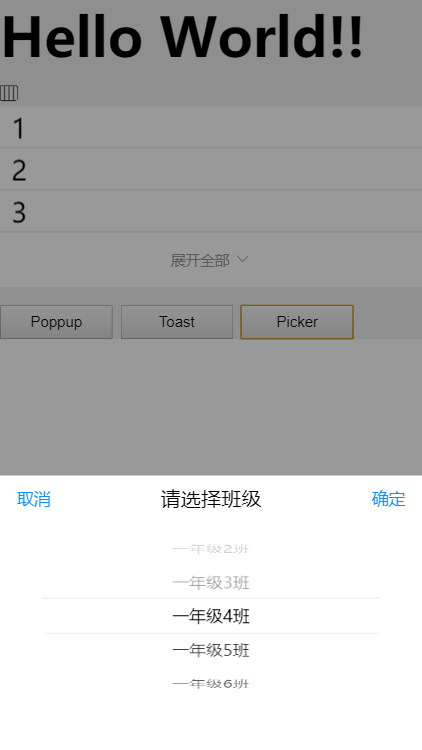

# Picker

项目选择器，传入一组格式相同的数据，用选择触发回调；该组件模拟轮子滚动效果

## 引入与使用

### 组件内使用

```javascript
import Toast from '../../appassets/components/Toast';
import Picker from '../../appassets/components/Picker';
export default {
    mounted() {
         this.picker = Picker({
            title: 'Picker',
            data: [
                {text: '一年级1班', value: '1'},
                {text: '一年级2班', value: '2'},
                {text: '一年级3班', value: '3'}
            ],
            onSelect(text, value, index) {
                Toast({
                    text: 'text:' + text + '  value:' + value + '  index：' + index
                })
            },
            onCancel() {
                Toast({
                    text: '取消了'
                })
            }
        });
    },
    methods {
         pickerHandle() {// 调起picker
              this.picker.show();
         }
    }
};
```

### 全局注册Picker组件

```javascript
import Vue from 'vue';
import Picker from "../../appassets/components/Picker";
Vue.use(Picker);
```

引入之后可以在各个组件中使用$Picker

```javascript
export default {
    mounted() {
        this.picker = this.$Picker({});
    }
};
```

## 例子

Picker中的每一个选项，通过`params.data`传入，有两个回调函数，分别在取消和选择时触发；如图：



## API

| 参数                       | 说明      | 类型       | 可选值  | 默认值  |
| ------------------------ | ------- | -------- | ---- | ---- |
| params                   | 配置选项    | Object   | -    | {}   |
| params.title             | 标题      | string   | -    | ''   |
| params.data              | 选项列表    | Array    | -    | -    |
| params.data[index].text  | 每个选项的文案 | String   | -    | -    |
| params.data[index].value | 每个选项的值  | any      | -    | -    |
| params.onSelect          | 确定选择时回调 | Function | -    |      |
| params.onCancel          | 取消选择时回调 | Function | -    |      |

- ***onSelect事件接受三个参数***

| 参数名   | 描述       |
| ----- | -------- |
| text  | 被选中选项的文案 |
| value | 被选中选项的值  |
| index | 被选中选项的索引 |

