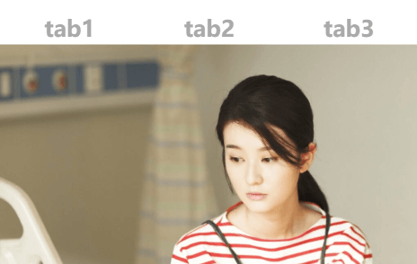

# TabBox

基于Vue可滑动Tab切换组件

## 引入与使用

```html
<template>
   <div class="t-around">
        <button @click="itemId='t1'" class="btn">tab1</button>
        <button @click="itemId='t2'" class="btn">tab2</button>
        <button @click="itemId='t3'" class="btn">tab3</button>
    </div>
    <div class="loop-wrap">
        <tab-box v-model="itemId">
            <tab-item id="t1">
                
            </tab-item>
            <tab-item id="t2">
                
            </tab-item>
            <tab-item id="t3">
                
            </tab-item>
        </tab-box>
    </div>
</template>

<script>
    import tabBox from '../../appassets/components/TabBox';
    import tabItem from '../../appassets/components/TabItem';
    export default {
        data() {
            return {
                itemId: 't1'
            };
        },
        components: {
            tabBox,
            tabItem
        }
    };
</script>
```

## 例子

通过`v-model`绑定切换tab的唯一索引，该值取自`tab-item`组件的id值。



## API

| 参数      | 说明                                                   | 类型    | 可选值     | 默认值 |
| --------- | ------------------------------------------------------ | ------- | ---------- | ------ |
| v-model   | 切换tab的唯一索引<br />取值范围所有子组件tabItem的id值 | -       | -          | -      |
| swipeable | 是否可滑动                                             | Boolean | true,false | true   |

